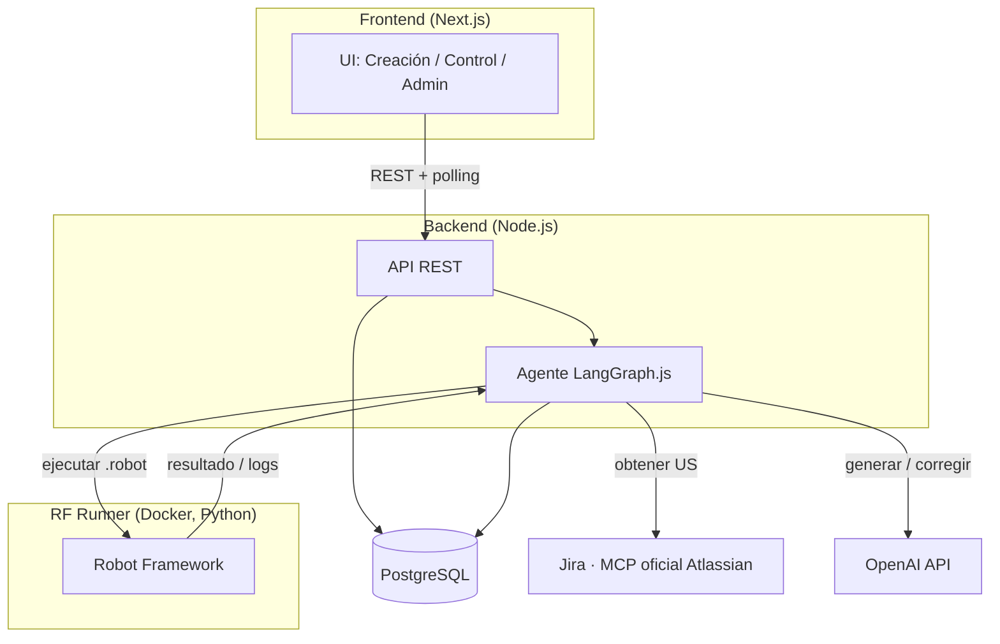
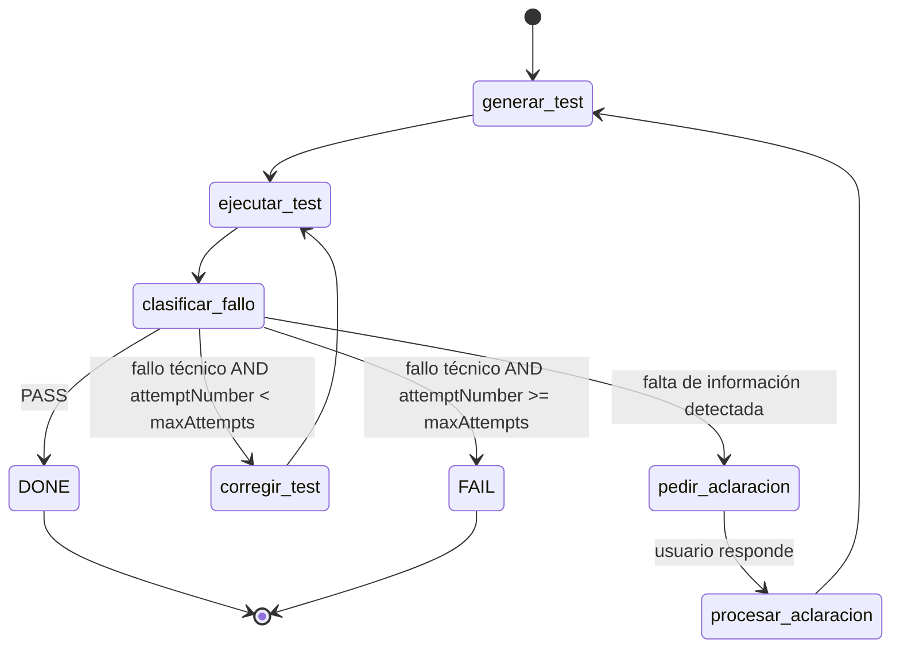
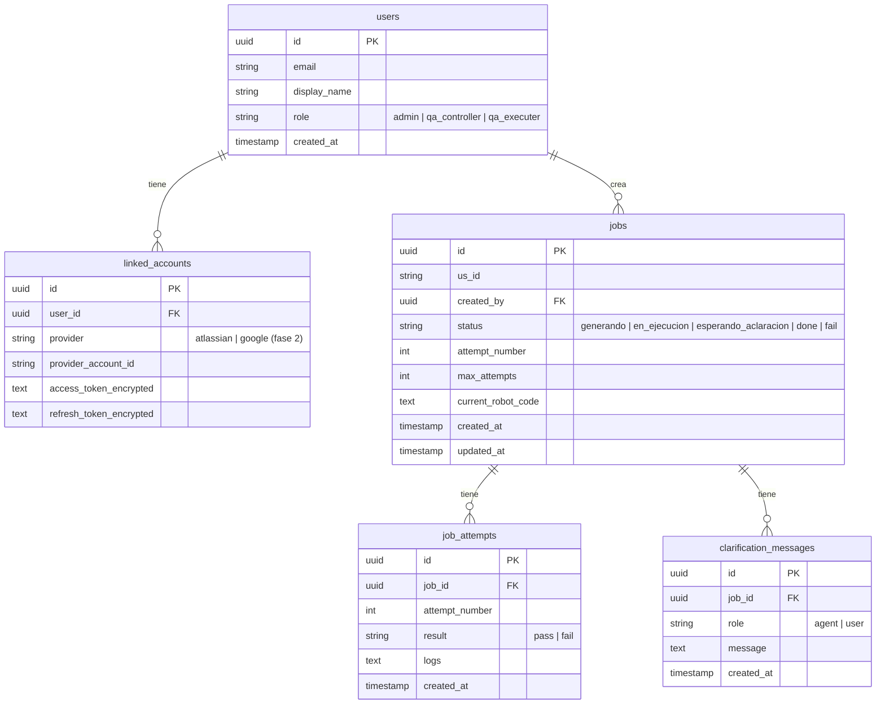
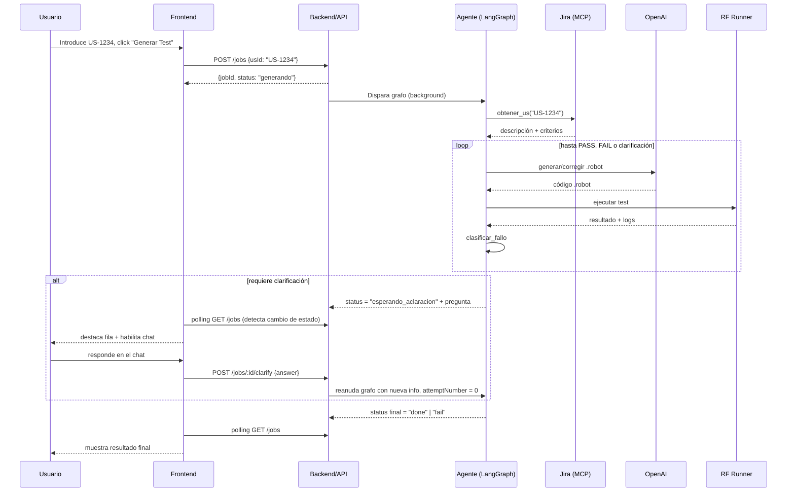

# YouAutoQA — Design Doc

> Complementa a `YouAutoQA_Requisitos.md` (el qué) y `YouAutoQA_Plan.md` (el cuándo). Este documento es el **cómo**: arquitectura de componentes, diseño técnico del grafo, modelo de datos y contratos de API para las Fases 0–5 (walking skeleton local).
> El diseño detallado de infraestructura AWS/Terraform se aborda en la Fase 7 (ver `YouAutoQA_Plan.md`) y no se incluye aquí para no quedar desactualizado antes de tiempo.
> Última actualización: 17/09/2026

---

## 1. Arquitectura de componentes (vista local / walking skeleton)



**Notas de diseño:**
- El **Agente** vive dentro del proceso del Backend (no es un servicio aparte) — es un módulo que el API invoca de forma asíncrona al crear un job.
- El **RF Runner** es un contenedor Docker independiente; el backend lo invoca como proceso aislado (`docker run` o llamada a un contenedor ya corriendo, según se decida al implementar) y lee su salida (report/log/output.xml).
- Todo el entorno local se levanta con `docker-compose` (backend, runner, Postgres). El frontend corre aparte con `npm run dev` (no necesita estar dockerizado en local).

---

## 2. Diseño del grafo LangGraph

### 2.1 Estado del grafo (`GraphState`)

```typescript
interface GraphState {
  jobId: string;
  usId: string;                    // ej. "US-1234"
  usDescription: string;
  acceptanceCriteria: string;
  clarifications: { question: string; answer: string }[]; // se acumulan si hay varias rondas (RF-9)

  currentRobotCode: string | null;
  attemptNumber: number;           // se resetea a 0 tras una clarificación (RF-9)
  maxAttempts: number;             // 5, ver RNF-1

  lastExecutionResult: {
    status: "pass" | "fail";
    logs: string;
  } | null;

  failureHistory: string[];        // errores de intentos previos, para detectar patrones repetidos
  status: "generando" | "en_ejecucion" | "esperando_aclaracion" | "done" | "fail";
}
```

### 2.2 Nodos

| Nodo | Entrada relevante | Salida / efecto |
|---|---|---|
| `generar_test` | `usDescription`, `acceptanceCriteria`, `clarifications` | `currentRobotCode` (nuevo) |
| `ejecutar_test` | `currentRobotCode` | `lastExecutionResult` |
| `clasificar_fallo` | `lastExecutionResult`, `failureHistory` | decide próximo edge: `tecnico` / `falta_info` / `pass` |
| `corregir_test` | `currentRobotCode`, `lastExecutionResult.logs` | `currentRobotCode` (corregido), `attemptNumber += 1` |
| `pedir_aclaracion` | `failureHistory` | interrupt del grafo — pausa esperando input humano |
| `procesar_aclaracion` | respuesta del usuario | añade a `clarifications`, resetea `attemptNumber = 0` |

### 2.3 Edges condicionales (lógica de decisión)



**El nodo más delicado a implementar es `clasificar_fallo`.** Criterio propuesto para el MVP: si el mismo tipo de error (ej. mismo selector no encontrado, mismo mensaje de ambigüedad) se repite igual en 2 intentos consecutivos, se interpreta como falta de información en la US en lugar de seguir corrigiendo a ciegas. Este heurístico se puede refinar durante la Fase 1 con casos de prueba reales.

---

## 3. Modelo de datos (PostgreSQL)



**Notas:**
- `linked_accounts` separada de `users` desde el diseño, aunque el MVP solo use Atlassian — así la Fase 2 (login con Google) no requiere migrar el esquema.
- `current_robot_code` vive en `jobs` (última versión), mientras que el histórico de código por intento, si se quiere conservar, puede añadirse como columna en `job_attempts` más adelante — no es estrictamente necesario para el MVP, se deja como decisión abierta.

---

## 4. Contrato de API (backend)

| Endpoint | Método | Body / Params | Respuesta | Notas |
|---|---|---|---|---|
| `/jobs` | POST | `{ usId: string }` | `{ jobId: string, status: "generando" }` | Dispara el grafo en background (RNF-3); no bloquea |
| `/jobs` | GET | query opcional `?status=` | `[{ jobId, usId, status, attemptNumber, createdAt }]` | Usado por la tabla de la pantalla de Creación de test (polling) |
| `/jobs/:id` | GET | — | `{ jobId, usId, status, attemptNumber, currentRobotCode, attempts: [...], clarifications: [...] }` | Detalle completo, usado en Control de test |
| `/jobs/:id/clarify` | POST | `{ answer: string }` | `{ jobId, status: "generando" }` | Responde a la última pregunta pendiente, reinicia `attemptNumber` a 0 |

**Autenticación:** todos los endpoints requieren sesión válida (cookie/JWT de NextAuth). La autorización por rol (RF-2) se aplica a nivel de middleware, antes de llegar al handler de cada endpoint — ej. `POST /jobs` requiere rol `admin` o `qa_controller`.

---

## 5. Estructura de carpetas (monorepo)

```
youautoqa/
├── backend/
│   ├── src/
│   │   ├── agent/            # grafo LangGraph: state, nodes, edges
│   │   ├── api/               # rutas Express/Fastify
│   │   ├── db/                 # esquema, migraciones, modelos
│   │   └── integrations/       # cliente MCP Jira, cliente OpenAI
│   ├── Dockerfile
│   └── package.json
├── frontend/
│   ├── app/ (o pages/)
│   │   ├── creacion/
│   │   ├── control/
│   │   └── admin/
│   └── package.json
├── rf-runner/
│   ├── Dockerfile
│   └── entrypoint.sh
├── infra/                     # Terraform — se puebla en Fase 7
├── docker-compose.yml
├── YouAutoQA_Requisitos.md
├── YouAutoQA_Plan.md
└── YouAutoQA_DesignDoc.md
```

---

## 6. Diagrama de secuencia — flujo completo (incluye clarificación)



---

## 7. Decisiones pendientes a resolver durante la implementación

- [ ] Formato exacto de invocación del RF Runner desde el backend (¿contenedor efímero por ejecución, o contenedor persistente con API interna?) — a decidir al implementar la Fase 1.
- [ ] Si se conserva `current_robot_code` por intento en `job_attempts` o solo la última versión en `jobs`.
- [ ] Umbral exacto del heurístico de `clasificar_fallo` (¿2 intentos iguales? ¿similitud de mensaje de error?) — a afinar con casos de prueba reales en Fase 1.
